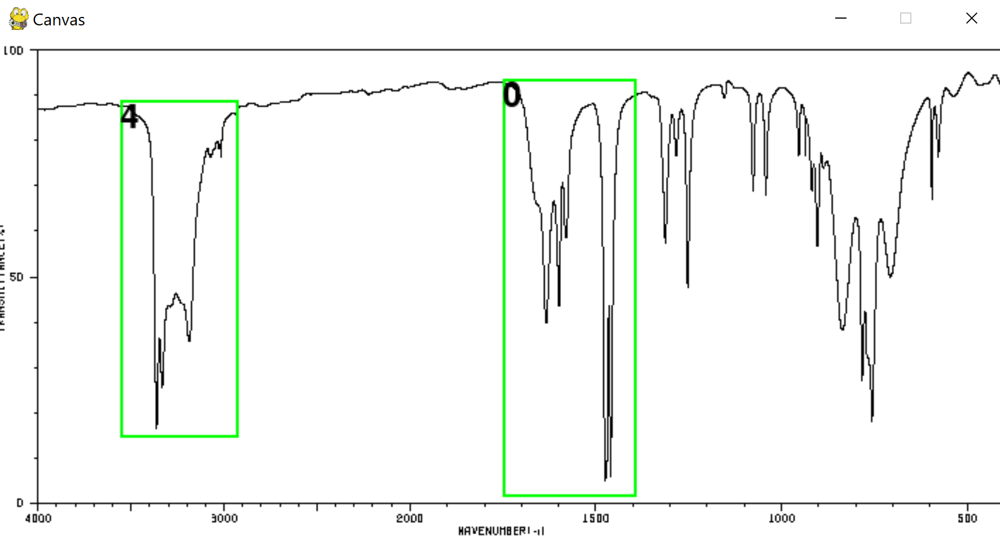

"# spectroGUI_curator" 
# Image Annotation Curator GUI



## Description

The Image Annotation Curator is a Python program that provides a simple graphical user interface (GUI) for visualizing images alongside their corresponding annotation data. The tool is designed to help users inspect and manage image datasets with associated annotations in JSON format.

## Features

- Loads images from a specified directory
- Reads corresponding annotation files in JSON format
- Displays images with their annotations overlaid
- Provides basic navigation through the image dataset
- Maintains proper aspect ratio and scaling based on original image resolution

## How It Works

The program works by:

1. Taking paths to image and annotation directories as input
2. Retrieving the resolution from a sample image to set the display canvas
3. Creating a GUI interface using a custom `GUICurator` class
4. Loading and displaying images with their corresponding annotations
5. Providing navigation controls to browse through the dataset

## Requirements

- Python 3.x
- Pillow (PIL) library
- Custom `guicurator` package (included in project)

## Installation

1. Clone this repository
2. Install the required dependencies:
   ```bash
   pip install Pillow